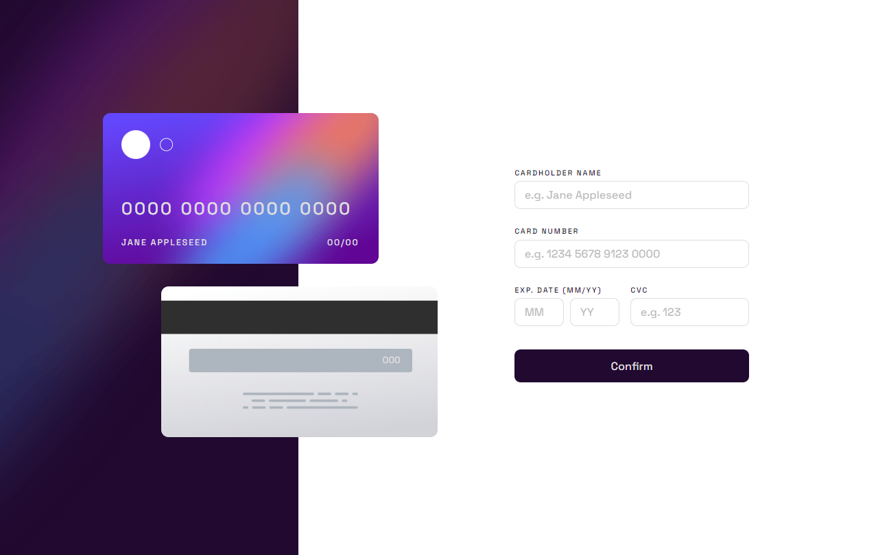
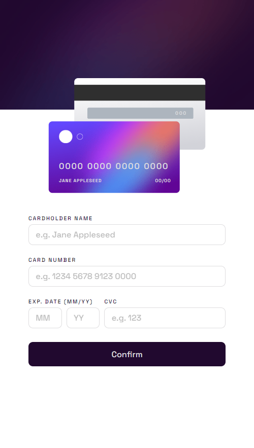

<h1 align="center" style="margin: 0">Interactive Card Details Form</h1>

Solution to the Frontend Mentor challenge

This is a solution to the <a href="https://www.frontendmentor.io/challenges/interactive-card-details-form-XpS8cKZDWw">Interactive card details form challenge on Frontend Mentor</a>. Frontend Mentor challenges help you improve your coding skills by building realistic projects.

## Screenshots

Desktop view

Mobile view

## Links

- Live Site URL (I use Netlify for websites hosting) ⇒ https://interactivecarddetailsform-km9.netlify.app

## Overview

### Features

Users should be able to:

- Fill in the form and see the card details update in real-time
- Receive error messages when the form is submitted if:
  - Any input field is empty
  - The card number, expiry date, or CVC fields are in the wrong format
- View the optimal layout depending on their device's screen size
- See hover, active, and focus states for interactive elements on the page

### Built with

- Angular
- HTML5
- SCSS
- TypeScript

## Find me on other platforms

- Frontend Mentor ⇒ https://www.frontendmentor.io/profile/k-malkiewicz
- iCodeThis ⇒ https://icodethis.com/Kamil
- Codewars ⇒ https://www.codewars.com/users/k_malkiewicz
- freeCodeCamp ⇒ https://www.freecodecamp.org/kamil_malkiewicz